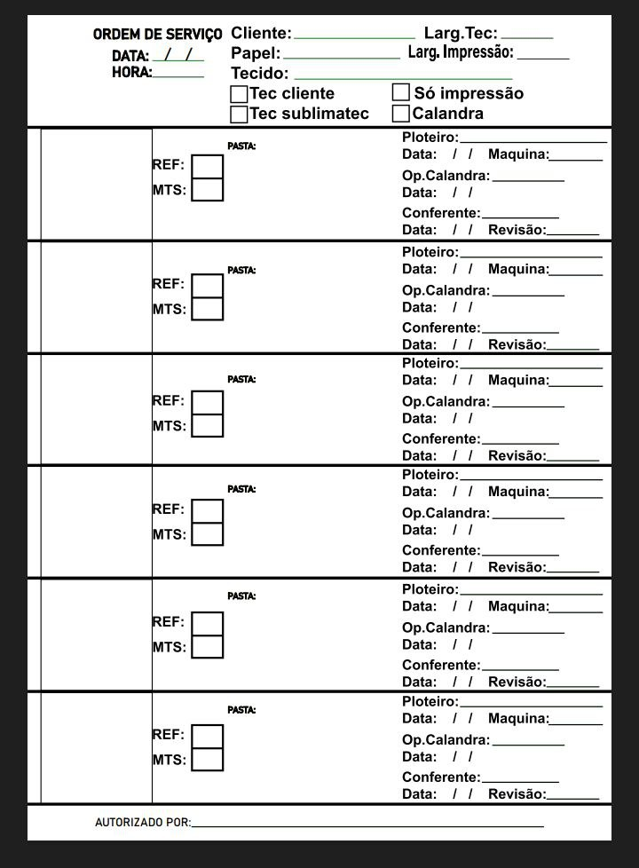

# Projeto Programação Orientada a Objetos 
## Primeira entrega

### ⏺️ História do Usuário

➡️ [História do Usuário](https://docs.google.com/document/d/1hoB7Cg6qycSNQD4wTxnoZE7-cdvidArfGntpcaNiHuY/edit?usp=sharing)
     

### ⏺️ Lo-Fi

  
*(Lo-fi Ordem de Serviço)*
     

### ⏺️ Screencast

[Screencast Disponível](https://youtu.be/HueqqPeg3l0)